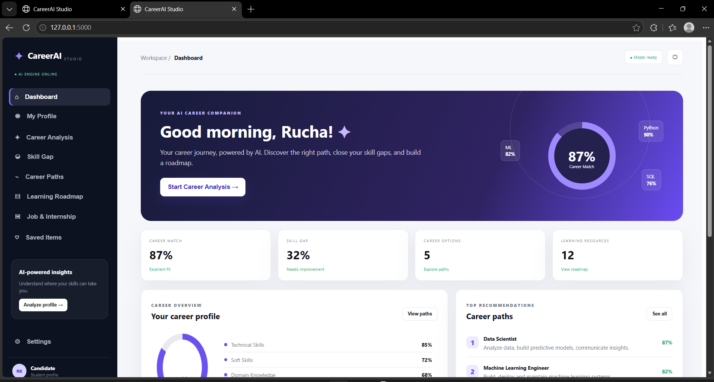
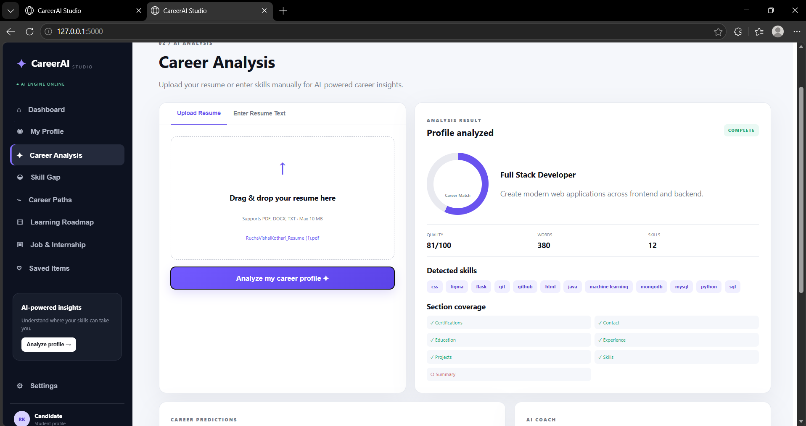
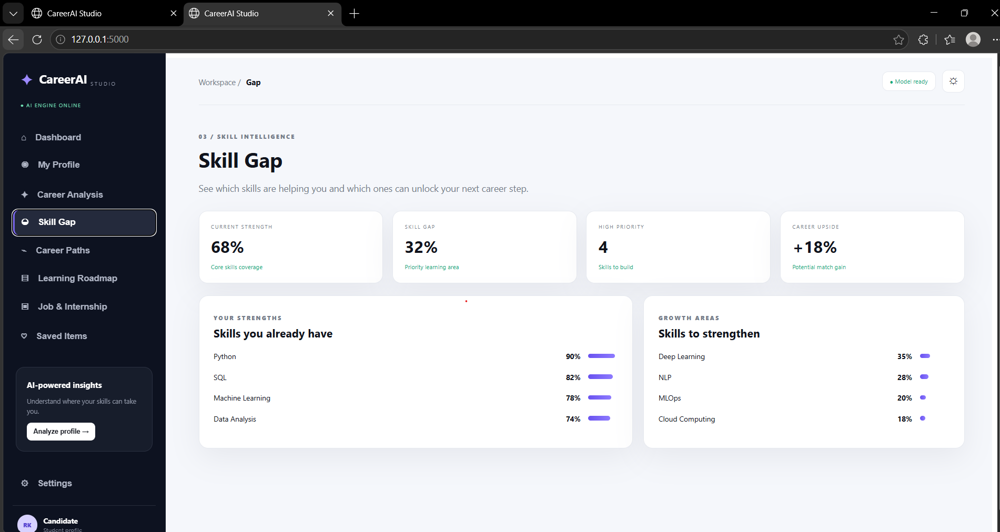
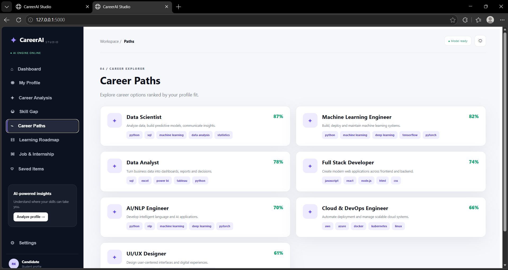
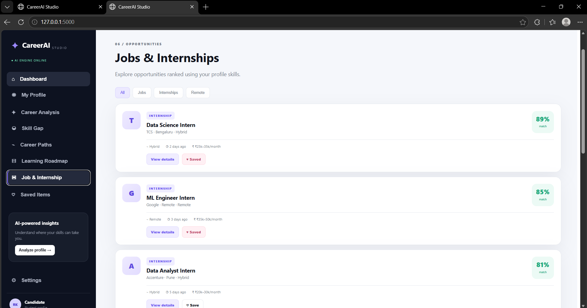

# 🚀 CareerAI Studio — AI Career Path & Skill Gap Analyzer

CareerAI Studio is a professional AI-powered career analysis platform that helps students and job seekers understand their skills, discover suitable career paths, identify skill gaps, and build a personalized learning roadmap.

The application provides a modern responsive dashboard with resume analysis, career scoring, skill extraction, career recommendations, learning resources, and job/internship discovery.

---

## ✨ Features

- 🎨 Professional responsive SaaS UI/UX
- 📄 Resume upload support — PDF, DOCX, TXT
- 🤖 AI-powered career analysis
- 📊 Career-fit scoring
- 🧠 Skill extraction from resume/profile
- 📈 Skill-gap analysis
- 🎯 Career-path recommendations
- 📚 Personalized learning roadmap
- 💼 Job & internship discovery
- 🔎 Job/internship filters
- 📑 PDF career report generation
- 🌙 Dark / Light theme
- 📱 Mobile-responsive interface
- ⚡ Demo profile for instant testing

---

## 🖥️ Project Screenshots

### 📊 Career Dashboard



### 🏠 Dashboard Overview


### 📈 Career Analysis



### 🧠 Skill Gap Analysis



### 🎯 Career Path Recommendations



### 💼 Jobs & Internships



---

## 🧠 How It Works

```text
Resume / User Profile
        ↓
Resume Text Extraction
        ↓
Skill Extraction
        ↓
Structured Skill Profile
        ↓
Career Matching
        ↓
Career-Fit Score
        ↓
Skill Gap Analysis
        ↓
Career Recommendations
        ↓
Personalized Learning Roadmap
        ↓
Jobs & Internship Discovery
